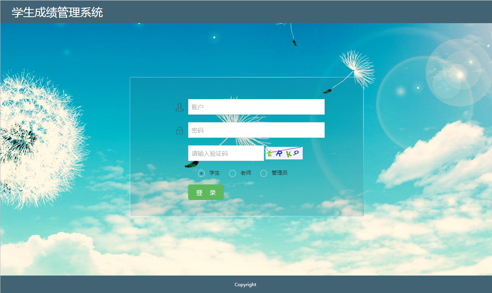
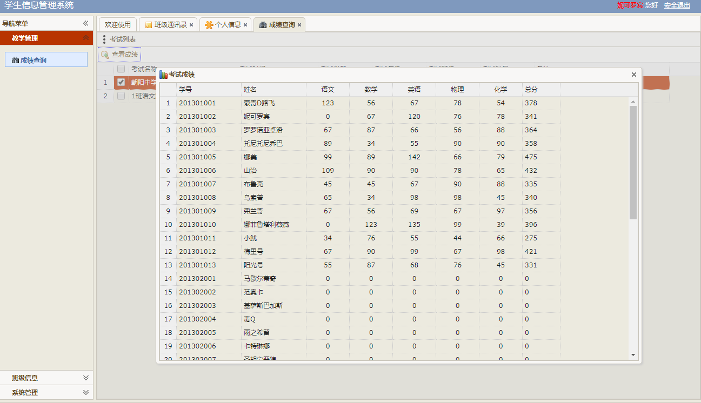
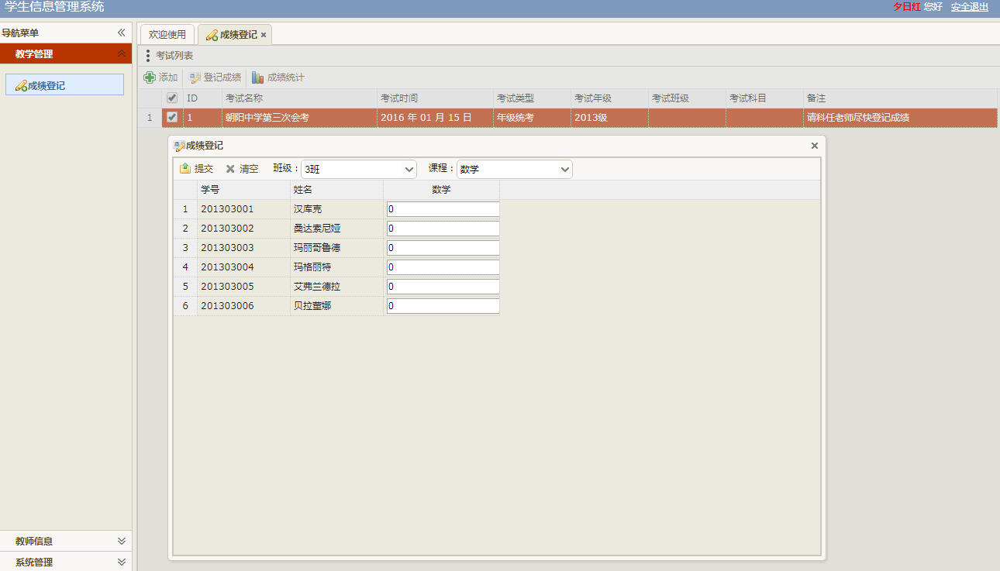
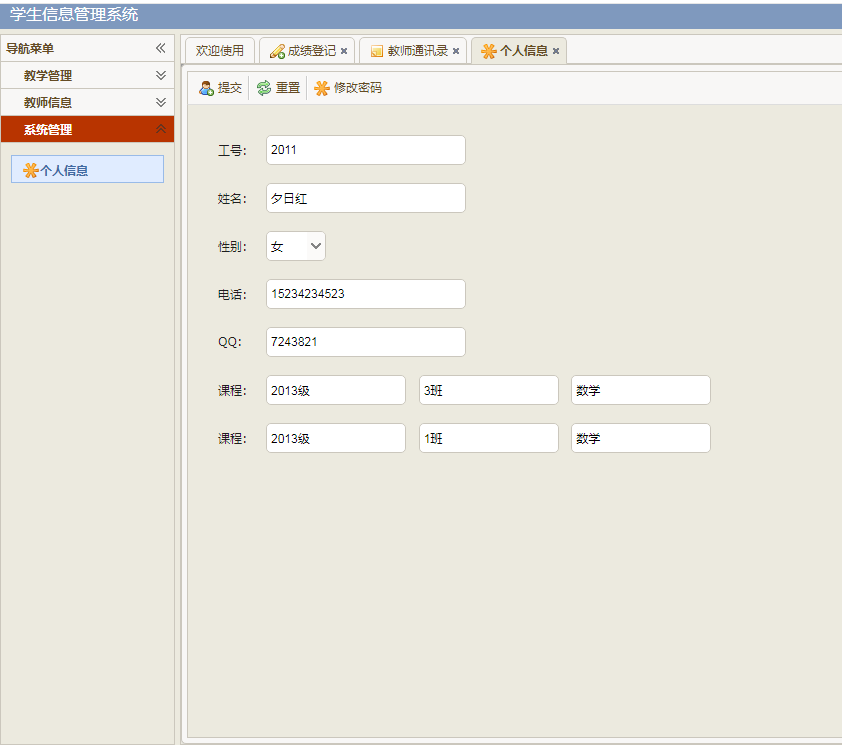
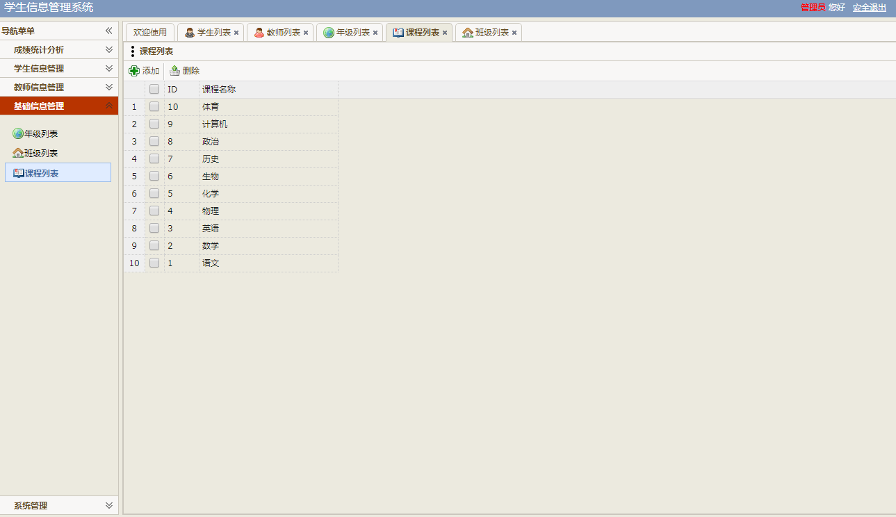

# 学生信息管理系统

> 可用于毕业设计参考或者个人学习

## 系统用户按权限分为三种，即管理员，教师，学生。不同的用户拥有不同的权限，各自完成各自的管理功能，不同的用户看到不同的系统功能。

### 管理员：
（1）	登录功能：通过前台验证用户密码，验证成功后可以登录。
（2）	教师信息管理：具体包括教师信息进行维护。
（3）	学生信息管理：对学生信息进行维护。
（4）	系统信息管理：对系统所在科室进行维护。
（5）	诊室选课管理：对医生所在诊室信息进行维护。
（6）	修改个人密码功能。
### 教师：
（1）	登录功能
（2）	基本信息查询：可以对本人信息、进行查询修改。
（3）	教学管理：添加添加考试，登记成绩，成绩统计。
（4）	教师信息：可以对教师通讯录进行查看。
### 学生：
（1）	登录功能
（2）	基本信息查询：可以对本人信息、进行查询修改。
（3）	教学管理：可以查看自己的考试成绩。
（4）	班级信息：可以查看自己的通讯录。

### 技术要求	
1. Servlet+Jsp+Jdbc+dbutils+EasyUI+jQuery+Ajax+面向接口编程；
2. 使用SQL Server或MySQL作为后台数据库，依据数据库设计过程及规范，设计数据库表结构及主外键关系，并结合功能需求适当设计存储过程和触发器；
3. 采用面向对象设计方法学，运用所学的面向对象分析设计方法，以及对应的工具对系统进行分析与设计建模；
4. 基于模块化编程思想，程序源文件应划分为相应package，组织层次清晰；
5. 遵循程序设计编码规范，标识符应命名规范、代码注释充分、排版风格良好；

### 部分系统截图

# 源码完整版 可加qq：625285133 咨询获取，可一对一专业指定需求，个性化制定代码。
# 后续持续更新新系统，敬请期待！
